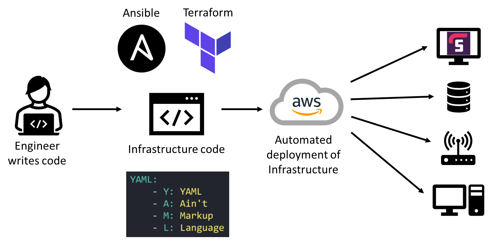

# Infrastructure as Code (IaC)

## Contents of Repository

   1. [Ansible - Controller Setup](https://github.com/bradley-woods/tech230-iac/blob/main/ansible-controller-setup.md)

   2. [Ansible - Ad-hoc Commands and Playbooks](https://github.com/bradley-woods/tech230-iac/blob/main/ansible-adhoc-and-playbook.md)

## What is IaC?

Infrastructure as Code (IaC) is the process of managing and deploying IT infrastructure such as servers, networking devices and other computing resources using code instead of using manual operations.

IaC uses human writeable and machine readable code such as YAML to improve infrastructure configuration and deployments, which would usually have to be set up by logging in via SSH or using a provisioning script.

## Benefits of IaC

Provisioning infrastructure can be a time consuming manual process, especially with physical infrastructure.

With recent shift of physical hardware in data centres to the cloud using virtualisation and containerisation, IaC can help a business manage their IT infrastructure while providing consistency, repeatability, and reducing errors involved with manual configuration.

- Cost reduction
- Faster deployments
- Reduction in errors
- Improved consistency
- Configuration drift elimination

## Configuration Management using Ansible

Ansible is an automation tool which is used for configuration management. It can be used to automate provisioning, configuration and management of IT infrastructure and install services, resources, applications etc. inside the VM.

With Ansible, you can manage and facilitate multiple servers regardless of cloud provider. It can communicate with the servers simultaneously to perform different tasks.

Ansible uses Playbooks written in YAML to describe the tasks to be performed on the VMs quickly which can produce repeatable, re-usable and simple configurations of multi-machine deployments to automate IT infrastructure.

### Benefits of Ansible

- **Free** - Ansible is an open-source tool

- **Agentless** - Only the master (control node) needs Ansible and the agents (managed nodes) do not need Ansible installed on them

- **Efficient** - No extra software needed so more capacity for app resources on the server

- **Flexible** - Can configure entire app environment no matter where its deployed (public cloud, hybrid, on-prem, CentOS, Ubuntu etc.)

- **Powerful** - Can model complex infrastructure and workflows

- **Simple and easy** - No special coding skills required to use Ansible playbooks as it uses human friendly YAML code

## Orchestration using Terraform

Terraform is an open-source orchestration and infrastructure as code tool that enables you to safely and predictably provision and manage infrastructure in any cloud.

### Benefits of Terraform

- **Consistency** - It allows you to define your infrastructure using a high-level configuration language, which means that you can specify the desired state of your infrastructure in a consistent and predictable way.

- **Repeatability** - It allows you to define infrastructure as modular components, which can be easily reused across multiple deployments. This can help reduce duplication and make it easier to manage your infrastructure at scale.

- **Version history** - It automatically maintains a version history of your infrastructure, which makes it easy to roll back to previous versions if necessary. This can help protect against mistakes and ensure that you can recover from failures quickly.

- **Easy collaboration** - The terraform registry (Terraform’s central registry version control) enables teams to collaborate on infrastructure.

- **Flexibility** - Terraform not only handles IaaS (AWS, Azure, etc) but also PaaS (SQL, NodeJS). It can also store local variables such as cloud tokens and passwords in encrypted form on the terraform registry.

- **Masterless** - Terraform is masterless, by default, i.e., it does not need a master node to keep track of all configuration and distributing updates. This saves the extra infrastructure and maintenance costs we’d have to incur in maintaining an extra master node.
