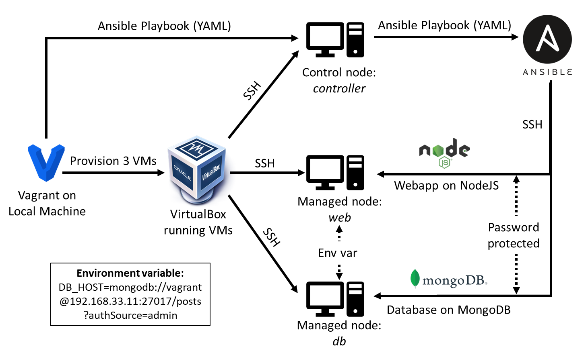

# Ansible - Ad-hoc Commands and Playbooks <!-- omit from toc -->

Once we have configured the Ansible controller, outlined [here](https://github.com/bradley-woods/tech230-iac/blob/main/ansible-controller-setup.md), we can use it to send Ad-hoc commands to the agent node or create an Ansible Playbook, which is a repeatable and re-usable template of instructions/tasks to perform on the agent node servers such as the 'web' group of servers. This Playbook can contain all the tasks required to install Nginx, NodeJS and NPM and run the application on port 3000.

- [Ansible Ad-hoc Commands](#ansible-ad-hoc-commands)
- [Ansible Playbook](#ansible-playbook)



## Ansible Ad-hoc Commands

Ad-hoc commands are useful for tasks that are NOT repetitive, they can be used on the controller node to run specific one-off commands on the agent node in the following format:

```bash
sudo ansible <agent-name> -m <command> -a "<module options>"
```

For example:

- To find out the Linux OS information of an agent/group of agents:

    ```bash
    sudo ansible <agent-name> -a "uname -a"
    ```

- To find out the date on the agent node (if its in another timezone):

    ```bash
    sudo ansible <agent-name> -a "date"
    ```

## Ansible Playbook

1. Firstly, navigate to `/etc/ansible/` and create the Ansible Playbook YAML file as follows:

    ```bash
    $ sudo nano <playbook-name>.yml
    ```

2. Inside the Playbook, we can use YAML-Ansible syntax to write our tasks, ensuring indentation is correct (2 spaces for each indent), as YAML is strict on indentation and case-sensitive.

    ```yaml
    # Playbook to install Nginx and run the app in web-server/s

    # add 3 dashes --- to start YAML file
    ---
    # add the name of the host
    - hosts: web

    # gather facts about the steps (show logs)
    gather_facts: yes

    # add admin access to this file (sudo)
    become: true

    # TASKS
    # -----
    tasks:
    # copy app folder from controller to web-server/s
    - name: Copy app folder from controller to web
        synchronize:
        src: /home/vagrant/app
        dest: /home/vagrant

    # install and enable Nginx
    - name: Installing Nginx
        apt: pkg=nginx state=present

    # install NodeJS
    - name: Installing NodeJS
        apt: pkg=nodejs state=present

    # install NPM
    - name: Installing NPM
        apt: pkg=npm state=present

    # start the application
    - name: Start the application
        command:
        chdir: /home/vagrant/app
        cmd: npm install
        cmd: npm start
    ```

    

3. We can now run the Ansible playbook using the following command, using the '`-v`' verbose flag for detail in the logs:

    ```bash
    $ sudo ansible-playbook -v config_web.yml
    ```

4. The following output should appear and the app should be running on the IP address of the web server at port 3000:

    

    
