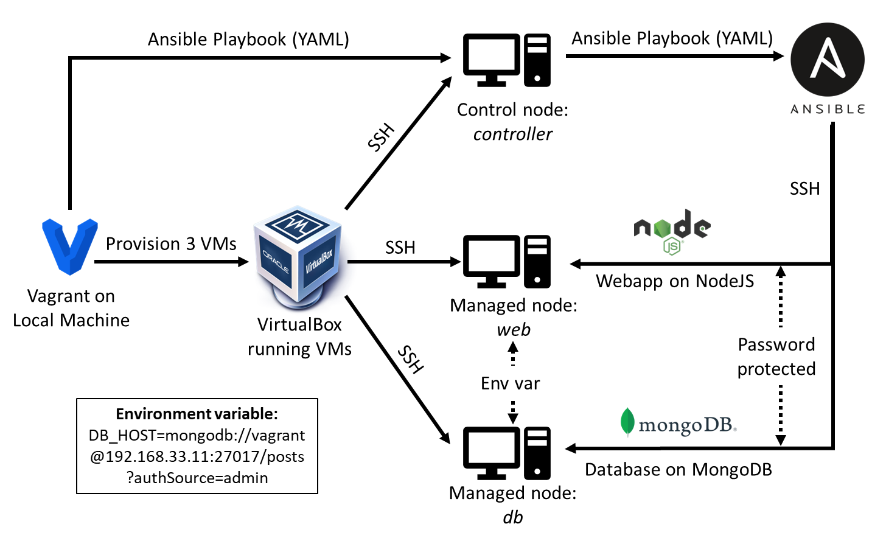
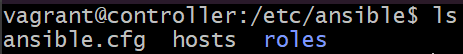
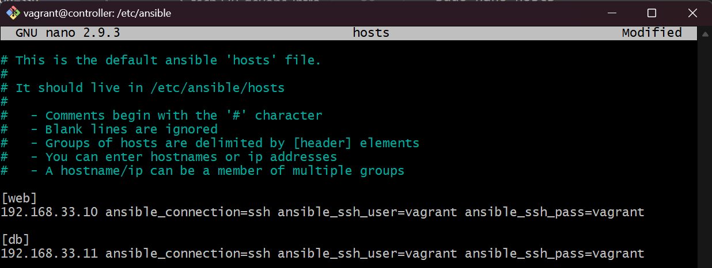
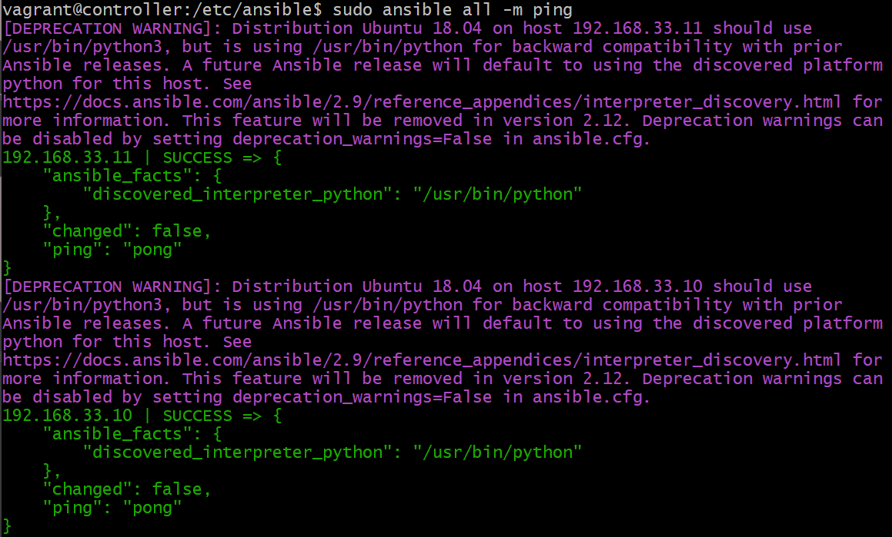
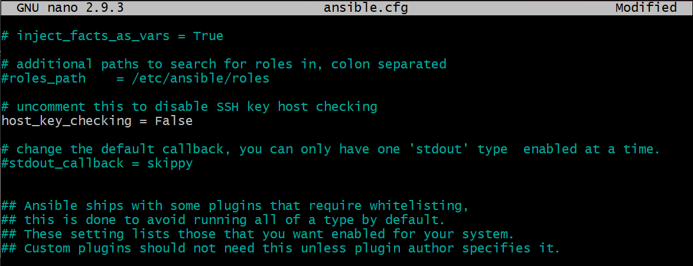

# Ansible - Controller Setup <!-- omit from toc -->

In this guide we will set up Ansible in the following configuration as shown in the diagram. This includes setting up one out of three VMs as the controller so the other two VMs can be used as managed nodes to server our webapp and database.

- [Provision VMs using Vagrant](#provision-vms-using-vagrant)
- [Check each VM](#check-each-vm)
- [Set up the Ansible Controller](#set-up-the-ansible-controller)
- [Testing Controller and VMs Connection](#testing-controller-and-vms-connection)



## Provision VMs using Vagrant

1. Firstly, set up 3 VMs by creating a Vagrantfile similar to how we made one to provision two-tier architecture in the previous repository (). The VMs should have the same OS (`bento/ubuntu-18.04`) and be configured with the following private IP addresses:

   - controller - 192.168.33.12
   - web - 192.168.33.10
   - db - 192.168.33.11

2. Using the Vagrantfile, run the following command to start the VMs:

    ```bash
    $ vagrant up
    ```

## Check each VM

The next step is to check each VM is running, has a stable internet connection and has the latest package source list.

1. Firstly, use the following command to ensure each VM is running:

    ```bash
    $ vagrant status
    ```

2. Next, SSH into each VM using the following command:

    ```bash
    $ vagrant ssh <name-of-VM>
    ```

3. Update and upgrade the package source list, and once it has finished installing the packages, `exit` the VM, repeat for each of the three VMs:

    ```bash
    $ sudo apt update -y && sudo apt upgrade -y
    ```

## Set up the Ansible Controller

1. Firstly, SSH into the controller VM and run the following commands to install the most common packages, add the Ansible repo and install Ansible:

    ```bash
    $ sudo apt update -y && sudo apt upgrade -y

    $ sudo apt install software-properties-common

    $ sudo apt-add-repository ppa:ansible/ansible -y

    $ sudo apt update -y

    $ sudo apt install ansible -y
    ```

2. Ansible only needs to be installed on the controller VM. Now that we have installed Ansible we can configure it to be able communicate with the other two VMs via password protected SSH. Ensuring we are still logged into the controller, we can SSH into the other two VMs (web and db) by using the following command:

    ```bash
    ssh vagrant@<ip-address-of-VM>
    ```

3. Once we have logged into each VM, it will ask to be added to the known hosts, which we can say `yes` to, and then it will ask for a password. In this case, the password is `vagrant`.

    > **Note:** when entering a password, nothing will appear but it will be entering it.

4. Now we can navigate to the default location for the Ansible architecture directory, so we can edit the configuration files (`hosts` and `ansible.cfg`) to set up Ansible:

    ```bash
    cd /etc/ansible
    ```

    

5. Using the following command to edit the `hosts` file, we need to add the key to both the webapp and database VM so the controller can communicate with them:

    ```bash
    sudo nano hosts
    ```

6. Next, we can add the IP address of each VM to the hosts list, setting the connection as SSH and the username and password as vagrant.

    

    > **Note:** we can group the IP address using labels e.g. [web] so if we have multiple web servers and want to perform tasks on them like updating their version of Python, we can simply call the group instead of each individual IP address.

## Testing Controller and VMs Connection 

1. Once you have saved and exited the `hosts` file, we can test the connection to the VMs using the `ping` module:

    ```bash
    sudo ansible all -m ping
    ```

2. The following should be returned in the log which indicates a successful connection:

    

3. If the connection was not a success, it may be because the VMs are not in the `known_hosts` file in the .ssh folder. Therefore, we can temporarily connect to them by turning off SSH checking in the `ansible.cfg` file, and then once connected we can turn it back on to ensure security.

    
